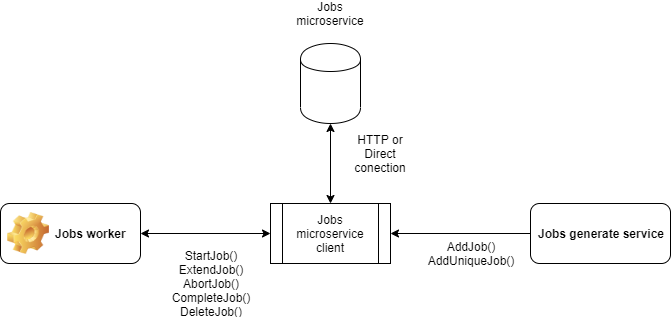

#  <br> Jobs microservice

This is the jobs microservice. It keeps list of working jobs.

The service allows you to manage tasks in those cases when the generation (statement) of the task is performed in a separate microservice, and direct execution is implemented in one way or another.
One of the application options, see the following diagram:
<br>  <br>

To create a task, a simplified data model is used which should contain the following information:
- type - task type
- ref_id - identifier of the object on which the task will work
- ttl - the maximum lifetime of the task before its execution
- params - additional parameters necessary to complete the task

The created task is stored in the following form:
- id unique identifier
- type - task type
- ref_id - identifier of the object on which the task will work
- params - additional parameters necessary to complete the task
- created - time stamp for creating a task
- started - time stamp of the task start
- locked_until - task lock time stamp
- execute_until - time stamp of task execution restriction
- completed - time stamp for completing a task
- retries - number of starts

Task management is carried out through the API described below.

The microservice currently supports the following deployment options:
* Deployment platforms: Standalone Process
* External APIs: HTTP/REST
* Persistence: Memory, Flat Files, MongoDB

<a name="links"></a> Quick Links:

* [Download Links](doc/Downloads.md)
* [Development Guide](doc/Development.md)
* [Configuration Guide](doc/Configuration.md)
* [Deployment Guide](doc/Deployment.md)
* Client SDKs
  - [Node.js SDK](https://github.com/pip-services-infrastructure/pip-clients-jobs-node)
  - [Dart SDK](https://github.com/pip-services-infrastructure/pip-clients-jobs-dart)
* Communication Protocols
  - [HTTP Version 1](doc/HttpProtocolV1.md)

## Contract

Logical contract of the microservice is presented below. For physical implementation (HTTP/REST),
please, refer to documentation of the specific protocol.

```dart
class NewJobV1 {
  String type;
  String ref_id;
  num ttl;
  dynamic params;
}

class JobV1 implements IStringIdentifiable {
  // Job description
  String id;
  String type;
  String ref_id;
  dynamic params;

  // Job control
  DateTime created;
  DateTime started;
  DateTime locked_until;
  DateTime execute_until;
  DateTime completed;
  num retries;
}

abstract class IJobsV1 {
  Future<JobV1> addJob(String correlationId, NewJobV1 newJob);

  Future<JobV1> addUniqJob(String correlationId, NewJobV1 newJob);

  Future<DataPage<JobV1>> getJobs(
      String correlationId, FilterParams filter, PagingParams paging);

  Future<JobV1> getJobById(String correlationId, String jobId);

  Future<JobV1> startJobById(String correlationId, String jobId, num timeout);

  Future<JobV1> startJobByType(
      String correlationId, String jobType, num timeout, num maxRetries);

  Future<JobV1> extendJob(String correlationId, String jobId, num timeout);

  Future<JobV1> abortJob(String correlationId, String jobId);
  
  Future<JobV1> completeJob(String correlationId, String jobId);

  Future<JobV1> deleteJobById(String correlationId, String jobId);

  Future deleteJobs(String correlationId);

  Future cleanJobs(String correlationId);
}
```

## Download

Right now the only way to get the microservice is to check it out directly from github repository
```bash
git clone git@github.com:pip-services-infrastructure/pip-services-jobs-dart.git
```

Pip.Service team is working to implement packaging and make stable releases available for your 
as zip downloadable archieves.

## Run

Add **config.yaml** file to the root of the microservice folder and set configuration parameters.

Example of microservice configuration
```yaml
---
# Container descriptor
- descriptor: "pip-services:context-info:default:default:1.0"
  name: "pip-services-jobs"
  description: "Jobs microservice for pip-services"

# Console logger
- descriptor: "pip-services:logger:console:default:1.0"
  level: "trace"

# Performance counters that posts values to log
- descriptor: "pip-services:counters:log:default:1.0"
  level: "trace"

{{#MEMORY_ENABLED}}
# In-memory persistence. Use only for testing!
- descriptor: "pip-services-jobs:persistence:memory:default:1.0"
{{/MEMORY_ENABLED}}

{{#FILE_ENABLED}}
# File persistence. Use it for testing of for simple standalone deployments
- descriptor: "pip-services-jobs:persistence:file:default:1.0"
  path: {{FILE_PATH}}{{^FILE_PATH}}"./data/jobs.json"{{/FILE_PATH}}
{{/FILE_ENABLED}}

{{#MONGO_ENABLED}}
# MongoDB Persistence
- descriptor: "pip-services-jobs:persistence:mongodb:default:1.0"
  collection: {{MONGO_COLLECTION}}{{^MONGO_COLLECTION}}jobs{{/MONGO_COLLECTION}}
  connection:
    uri: {{{MONGO_SERVICE_URI}}}
    host: {{{MONGO_SERVICE_HOST}}}{{^MONGO_SERVICE_HOST}}localhost{{/MONGO_SERVICE_HOST}}
    port: {{MONGO_SERVICE_PORT}}{{^MONGO_SERVICE_PORT}}27017{{/MONGO_SERVICE_PORT}}
    database: {{MONGO_DB}}{{#^MONGO_DB}}app{{/^MONGO_DB}}
  credential:
    username: {{MONGO_USER}}
    password: {{MONGO_PASS}}
{{/MONGO_ENABLED}}

{{^MEMORY_ENABLED}}{{^FILE_ENABLED}}{{^MONGO_ENABLED}}
# Default in-memory persistence
- descriptor: "pip-services-jobs:persistence:memory:default:1.0"
{{/MONGO_ENABLED}}{{/FILE_ENABLED}}{{/MEMORY_ENABLED}}

# Default controller
- descriptor: "pip-services-jobs:controller:default:default:1.0"

# Common HTTP endpoint
- descriptor: "pip-services:endpoint:http:default:1.0"
  connection:
    protocol: "http"
    host: "0.0.0.0"
    port: 8080

# HTTP endpoint version 1.0
- descriptor: "pip-services-jobs:service:http:default:1.0"

# Heartbeat service
- descriptor: "pip-services:heartbeat-service:http:default:1.0"

# Status service
- descriptor: "pip-services:status-service:http:default:1.0"
```
 
For more information on the microservice configuration see [Configuration Guide](doc/Configuration.md).

Start the microservice using the command:
```bash
dart ./bin/run.dart
```

## Use

The easiest way to work with the microservice is to use client SDK. 
The complete list of available client SDKs for different languages is listed in the [Quick Links](#links)

If you use dart, then get references to the required libraries:
- Pip.Services3.Commons : https://github.com/pip-services3-dart/pip-services3-commons-dart
- Pip.Services3.Rpc: 
https://github.com/pip-services3-dart/pip-services3-rpc-dart

Add **pip-services3-commons-dart**, **pip-services3-rpc-dart** and **pip-services_jobs** packages
```dart
import 'package:pip_services3_commons/pip_services3_commons.dart';
import 'package:pip_services3_rpc/pip_services3_rpc.dart';

import 'package:pip_services_jobs/pip_services_jobs.dart';

```

Define client configuration parameters that match the configuration of the microservice's external API
```dart
// Client configuration
var httpConfig = ConfigParams.fromTuples(
	"connection.protocol", "http",
	"connection.host", "localhost",
	"connection.port", 8080
);
```

Instantiate the client and open connection to the microservice
```dart
// Create the client instance
var client = JobsHttpClientV1(config);

// Configure the client
client.configure(httpConfig);

// Connect to the microservice
try{
  await client.open(null)
}catch() {
  // Error handling...
}       
// Work with the microservice
// ...
```

Now the client is ready to perform operations
```dart
// Create a new job
final JOB = NewJobV1(
    type: 't1', ref_id: 'obj_0fsd', ttl: 1000 * 60 * 60 * 3, params: null);

    // Create the job
    try {
      JobV1 job1 = await client.createJob('123', JOB);
      // Do something with the returned job...
    } catch(err) {
      // Error handling...     
    }
```

```dart
// Get the job
try {
var job = await client.getJobByid(
    null,
    job1.id);
    // Do something with job...

    } catch(err) { // Error handling}
```   

## Acknowledgements

This microservice was created and currently maintained by
- **Sergey Seroukhov**
- **Nuzhnykh Egor**.
